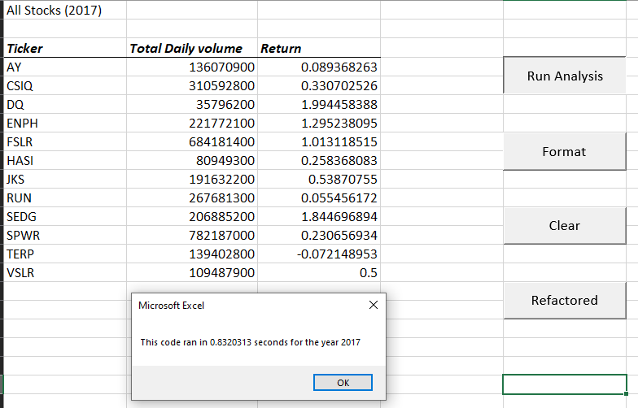
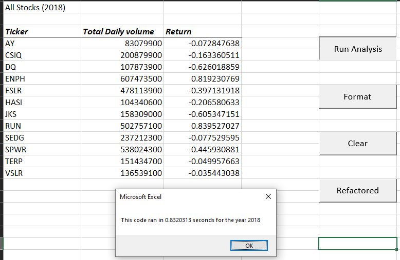
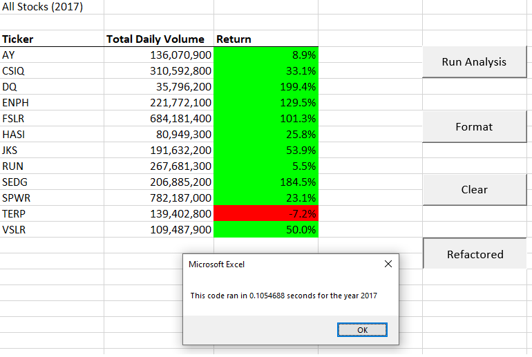
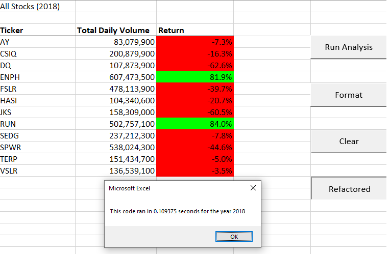

# Stock Analysis Overview
This analysis looks into the data from 12 tickers in the stock market for the year 2017 & 2018. First half of the analysis we use VBA script to clean and organize the data. Stocks are organized by its ticker name, total volume and its return for the year. The color and text is formatted for better readability. Macros are assigned so that the user can easily interact with the data. For the second half we refactor the script for it to run more effeciently. This improves the script and optimizes it if the user wants to run analysis on bigger projects.

## Results 
### Original
 

The original script tries to solve the problem with nested for loop which is not always efficient and also makes the code harder to read and understand.

### refactored 
 

The refactored code subsitutes nested for loop by adding arrays and variable and efficently using it on one loop. Which improves the codes run time and readability. 

## Summary
The advantages of refactoring code is that the code becomes more simplified and efficient, resulting in better performance. The code can be debugged and modified faster to accomodate different use cases.   
The disadvantages of refactoring code is that the process is very time consuming as the code is being rewritten with new logic. It requires full understanding of what the original code is doing so that you can create a more efficient system. It might not always be worth the risk as you weigh the time it takes to write a new code from scratch vs refactoring an old code that was written poorly. 
 
 
The advantage of the original VBA script is that it worked and did the task successfully. Disadvantages being that the script cannot scale up very well as the data sets start to get larger. Modifying the script is also not easy as it was build for one specific task. 
 
The advantage of the refactored VBA script is that it does the same thing as the original but with better performance. Which helps if you want to analyze bigger data sets. It is also easier to understand, easier to maintain and has more functionality for the future. 
